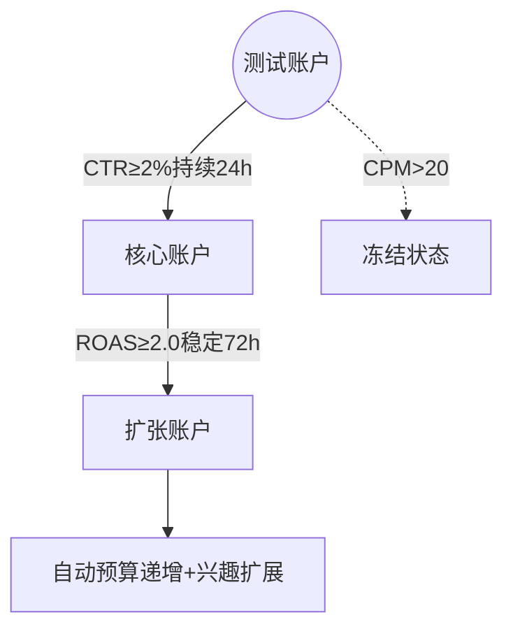

# Facebook广告智能优化体系（全实战版）

---

## 一、动态账户架构配置

### 1.1 智能层级引擎


### 1.2 关键操作阈值
| 操作类型       | 触发条件                | 执行方案                  |
|---------------|-------------------------|---------------------------|
| 紧急暂停       | CPM突增50%              | 次日00:00重启             |
| 预算追加       | CTR同比上涨25%           | 黄金时段+30%预算          |
| 受众刷新       | 频次>3次/周             | 清洗旧受众+导入类似名单    |

---

## 二、创意工场标准流程

### 2.1 全要素测试方案
**四维创意矩阵**
- 视频素材：首3秒悬念开场+进度条提示
- 图文素材：痛点场景+价格对比+限时标签
- 轮播广告：产品演变史+用户证言+购买凭证
- 动态素材：实时库存显示+浮动倒计时

### 2.2 熔断响应机制
```python
if 素材达到衰退期：
    启用备选库Top3素材
    调整出价策略(-15%~20%)
    推送优化警报至运营者
else:
    维持当前投放方案
```

---

## 三、精细化受众运营

### 3.1 五级运营模型
| 用户阶段       | 特征标签                   | 培育策略                |
|---------------|----------------------------|-------------------------|
| 潜在用户       | 首屏跳出率>80%            | 强痛点刺激素材          |
| 意向用户       | 多产品页对比               | 场景解决方案广告        |
| 高潜用户       | 深度参数页停留≥120s        | 精准定向投放            |
| 犹豫用户       | 多次访问未转化             | 差异化内容推送          |
| 忠诚用户       | 复购周期≤45天              | 组合产品推荐            |

### 3.2 再营销技术栈
**像素智能配置**
```bash
# 核心事件埋点
ViewContent → 产品页停留>15s
AddToCart → 加入购物车操作
Purchase → 支付成功验证

# 高级规则
购物车放弃用户 → 12h Messenger提醒
深度浏览用户 → 附加FAQ解决方案
```

---

## 四、数据决策系统

### 4.1 健康检测指标
| 维度           | 健康标准       | 优化方案                     |
|---------------|---------------|------------------------------|
| 频次指数        | ≤3次/周       | 清洗30天旧受众               |
| 素材衰减率      | ≤15%         | 启动模块重组                 |
| 时段效率差      | ≤20%         | 分时段预算调节               |

### 4.2 智能调控策略
```plaintext
时间序列预测模型:
    当日均CTR下降时自动启备选素材
    时转化率达高峰值追加对应时段预算
    用户活跃时段智能上调5%-10%出价
```

---

## 五、长效作战体系

### 5.1 素材生命周期
**四阶管理模型**
| 阶段   | 关键动作                  | 监控指标              |
|--------|---------------------------|-----------------------|
| 导入期 | 8组基础测试               | CTR≥1.8              |
| 成长期 | 追加兴趣词扩展            | ROAS≥1.5             |
| 成熟期 | 全时段推广                | 每日衰减率≤3%        |
| 衰退期 | 元素拆解重组              | 综合指数<60          |

### 5.2 团队协作规范
**全链路标准**
- 素材命名：日期_产品线_素材类型_版本（例：0422_服饰_视频_V5）
- 数据日报：每日08:00发送前24小时CTR/ROAS波动
- 紧急响应：设置三级警报机制（黄/橙/红）
[教学视频](https://youtube.com/shorts/nW0zv2vkNRI?feature=share)
